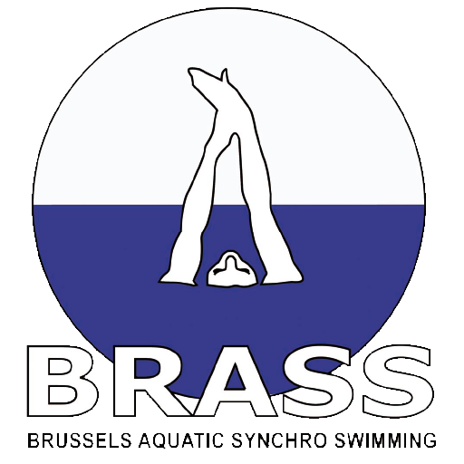
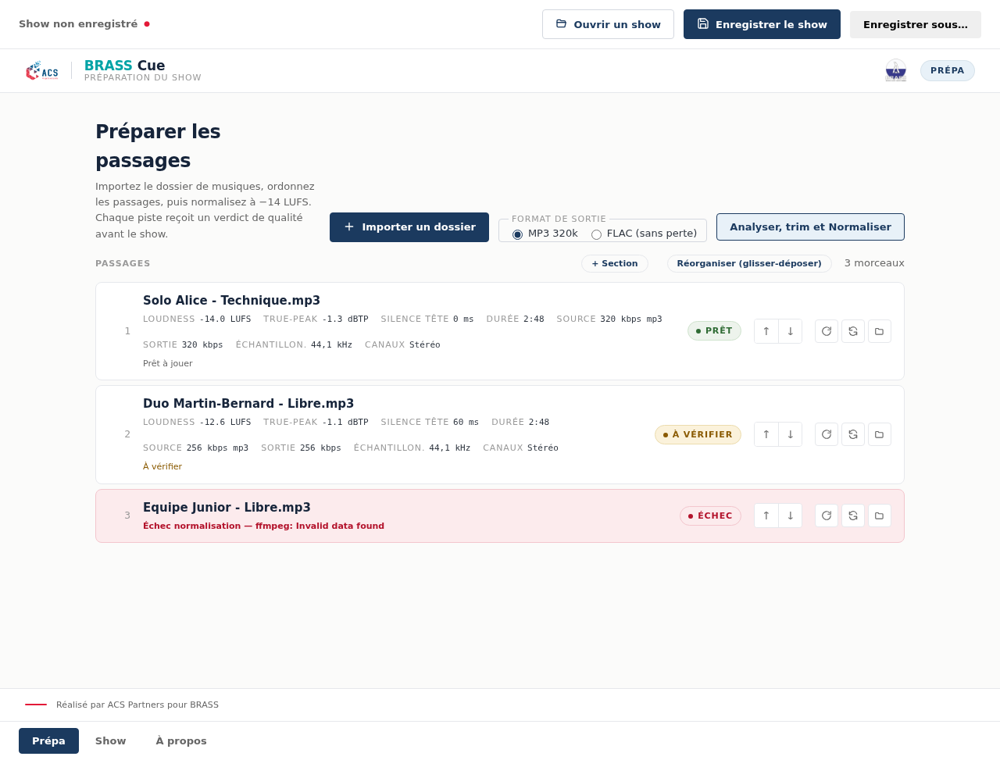
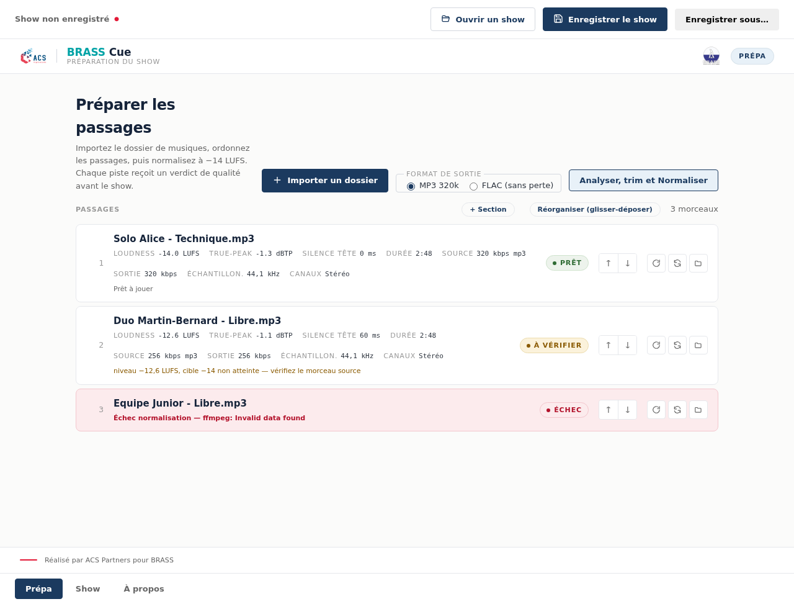
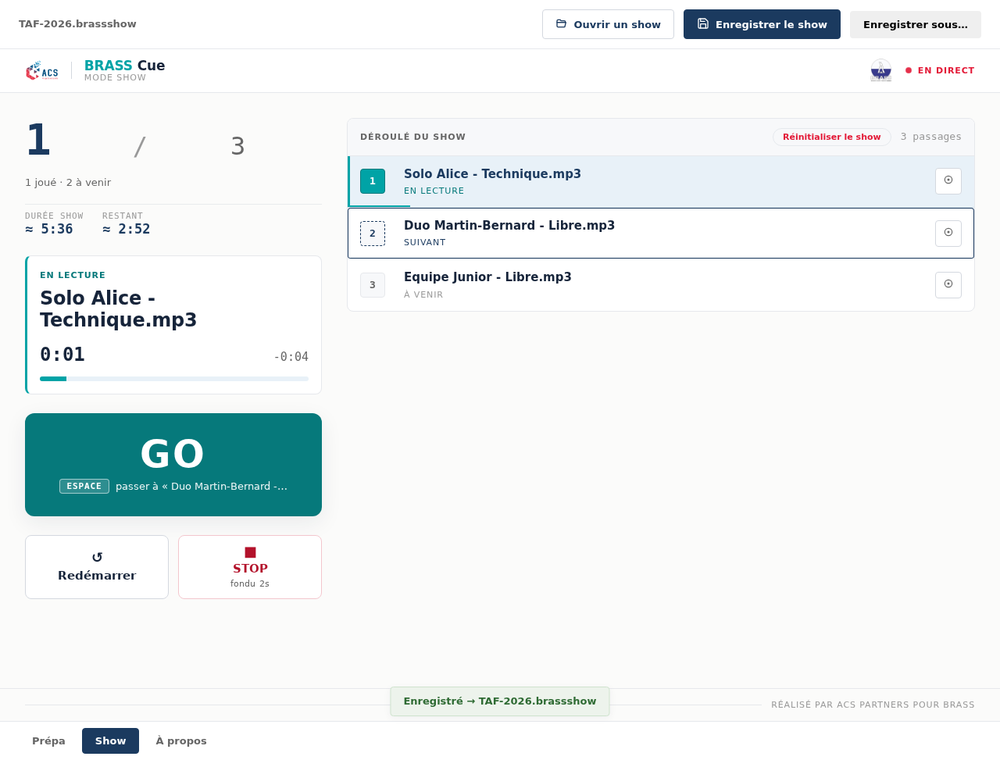
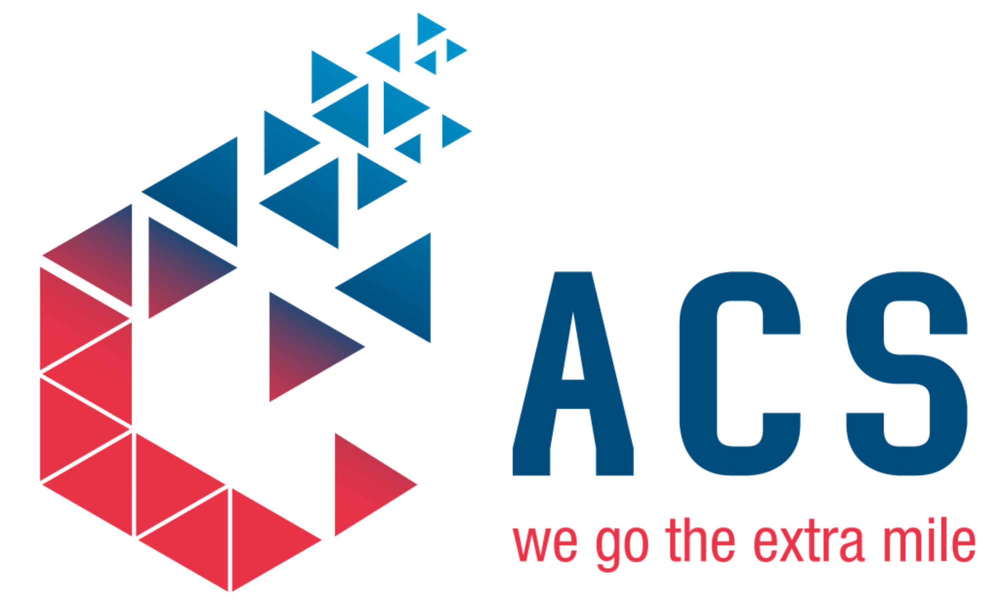

# BRASS&nbsp;Cue

**Le lecteur de musiques des compétitions de natation artistique.**
Import, mise à niveau du son, et conduite du show — au bord du bassin, sans Internet.

### 👉 [Télécharger la dernière version](https://github.com/ACS-Partners/BRASS-releases/releases/latest)

---

## C'est quoi ?

**BRASS Cue** est une application de bureau **gratuite** et **100 % hors-ligne** qui aide la
personne au son (« la Sono ») à gérer la musique pendant une compétition de natation
artistique. Tout est local : aucune connexion n'est nécessaire pendant l'événement.

Concrètement, elle vous permet de :

- **📥 Importer** vos morceaux (un dossier entier d'un coup), rangés par équipes / passages ;
- **🎚️ Mettre les niveaux d'aplomb automatiquement** — toutes les musiques sont normalisées
  au même volume, et le silence en début de piste est retiré, pour des départs nets ;
- **▶️ Conduire le show** depuis une liste de cues claire : un seul bouton pour lancer le bon
  morceau au bon moment, sans stress.

> Édité par **ACS Partners** · co-marque **BRASS** — Brussels Aquatic Synchro Swimming ([ebrass.be](https://www.ebrass.be/)).

---

## Aperçu

**Préparer la compétition** — importez et organisez vos passages

**Mettre le son d'aplomb** — normalisation automatique des niveaux

**Conduire le show** — la bonne musique, au bon moment, en un clic

---

## Comment installer (Windows)

1. **Téléchargez** le fichier voulu depuis la **[dernière version](https://github.com/ACS-Partners/BRASS-releases/releases/latest)** :

   | Fichier | Pour qui |
   |---|---|
   | **`BRASS-Cue-…-setup.exe`** ✅ *recommandé* | Installation normale : raccourci bureau / menu Démarrer **et mises à jour automatiques**. |
   | `BRASS-Cue-…-portable.exe` | Sans installation : un seul fichier à double-cliquer (clé USB, poste partagé). *Pas de mise à jour automatique.* |

2. **Lancez** le fichier téléchargé.

3. Windows affiche **« Windows a protégé votre PC »** (l'application n'a pas de signature
   payante — c'est normal pour un logiciel gratuit). Cliquez sur :

   > **Informations complémentaires** → **Exécuter quand même**

   C'est à faire **une seule fois**.

> 💡 Sur de rares PC où **Smart App Control** est activé, un logiciel non signé peut rester
> bloqué : il faut alors désactiver Smart App Control dans les paramètres Windows.

---

## Mises à jour automatiques

Avec la version **installée** (`setup.exe`), BRASS Cue **se met à jour toute seule** :

- elle vérifie les nouvelles versions au démarrage et les **télécharge en arrière-plan** ;
- quand c'est prêt, elle propose **« Redémarrer pour installer »** — **jamais** d'installation
  pendant que vous l'utilisez (aucune interruption en pleine compétition) ;
- vous pouvez aussi vérifier à la main depuis **À propos → Vérifier les mises à jour**.

La version *portable* ne se met pas à jour seule : revenez ici la télécharger quand une
nouvelle version sort.

---

## À propos de ce dépôt

Ce dépôt **public** ne contient **que les fichiers d'installation** et le **flux de mise à
jour** (`latest.yml`) lu par l'application. **Le code source reste privé.** Vous ne trouverez
ici aucun code — uniquement les versions à télécharger.

 

*Réalisé par ACS Partners pour BRASS · logiciel gratuit · © 2026 ACS Partners*

